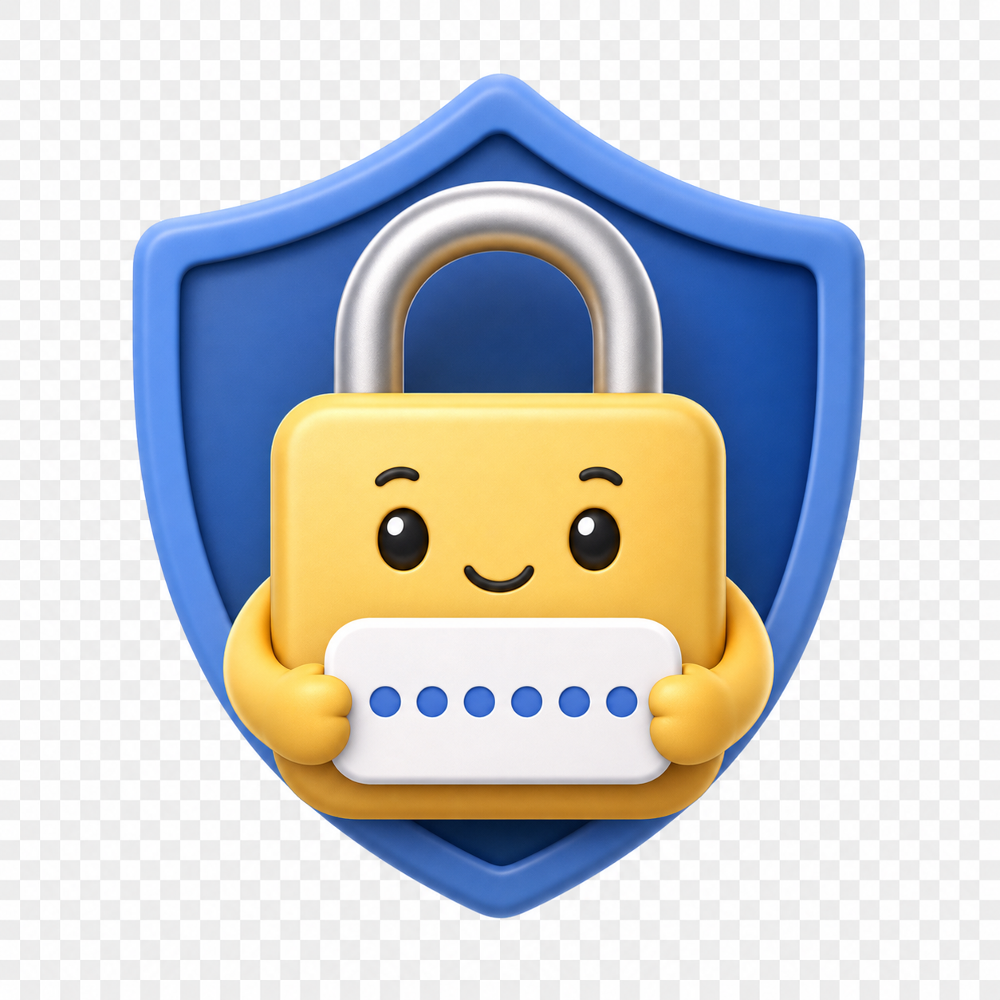

# authenticator-otp

**휴대폰의 Google Authenticator를 열지 않고, 맥에서 앱을 실행하는 것만으로 현재 인증 코드를 클립보드에 복사해 바로 붙여 넣을 수 있습니다.**

## 왜 쓰나요?

맥에서 로그인하다가 OTP를 입력해야 할 때, 휴대폰을 꺼내 인증 앱을 열고 숫자를 확인한 뒤 다시 맥으로 돌아오는 과정이 번거로울 수 있습니다. `auth-otp`는 이 기기 전환을 줄여, 작업하던 맥에서 인증 코드 입력까지 이어갈 수 있게 합니다.

본인의 TOTP 비밀키를 맥 키체인에 한 번 등록하면, 앱을 실행할 때마다 현재 인증 코드를 생성해 복사합니다. **코드를 눈으로 확인하거나 외워서 입력할 필요 없이, 로그인 화면에 붙여 넣으면 됩니다.**

## 이렇게 사용하면 편합니다

설정을 마친 뒤에는 다음 흐름으로 사용합니다.

1. 로그인 화면에서 OTP 입력이 필요하면 `⌘ Space`로 Spotlight를 엽니다.
2. `auth-otp` 또는 직접 정한 앱 이름을 검색해 실행합니다. 현재 인증 코드가 클립보드에 복사됩니다.
3. 로그인 화면의 인증 코드 입력란으로 돌아가 `⌘ V`로 붙여 넣습니다.

**맥에서 로그인 → 앱 실행 → 인증 코드 붙여 넣기.** 휴대폰의 인증 앱을 확인하느라 작업 흐름을 끊는 과정을 줄일 수 있습니다. 자주 사용한다면 앱을 Dock에 두고 실행해도 됩니다. 여러 계정은 `개인 OTP`, `보조 OTP`처럼 알아보기 쉬운 이름의 앱으로 구분할 수 있습니다.

서비스가 제공하는 TOTP 비밀키나 설정 URI를 본인이 등록해야 합니다. 휴대폰의 Google Authenticator 앱에서 코드를 가져오는 방식은 아닙니다.

[키체인 등록과 이름 정하기](docs/keychain-guide.md) · [보안 모델](SECURITY.md) · [기여 방법](CONTRIBUTING.md)

<p align="center"></p>

## 동작과 특징

- 비밀키는 사용자의 **로컬 login 키체인**에서만 읽습니다. JSON, `.env`, 앱 번들에 저장하지 않습니다.
- OTP와 비밀키를 터미널·알림·오류 메시지에 표시하지 않습니다.
- 런타임 네트워크 요청, 서버, 분석·추적 기능이 없습니다.
- Python 표준 라이브러리와 macOS 기본 도구를 사용합니다. `pip install`은 필요하지 않습니다.
- SHA1 / SHA256 / SHA512, 6자리 / 8자리 TOTP를 지원합니다. 기본값은 SHA1 / 6자리 / 30초입니다.

키체인은 저장된 비밀키를 보호하지만, 실행 중인 프로세스와 클립보드까지 모든 공격으로부터 보호하지는 않습니다. 상세 범위와 주의사항은 [SECURITY.md](SECURITY.md)를 읽어 주세요. 외부 보안 감사를 받은 제품은 아닙니다.

## 빠른 시작

### 1. 소스를 받고 Python을 확인합니다

```sh
git clone https://github.com/wondonghwi/authenticator-otp.git
cd authenticator-otp
python3 --version
```

**macOS와 Python 3.9 이상**이 필요합니다. Python이 없다면 [Python 공식 macOS 설치 프로그램](https://www.python.org/downloads/macos/) 또는 이미 사용 중인 패키지 관리자로 설치합니다. macOS에 Python이 기본 설치되어 있다고 가정하지 않습니다. 설치·빌드에 쓰는 Python 경로는 앱에 기록되므로 해당 Python을 제거하거나 옮기면 앱을 다시 설치해야 합니다.

### 2. 자신의 OTP 비밀키를 키체인에 등록합니다

Spotlight에서 **키체인 접근(Keychain Access)** 을 열고, `login` 키체인에 **새 암호 항목**을 만듭니다.

| 키체인 입력란 | 빠른 시작에서 사용할 값 |
| --- | --- |
| 키체인 항목 이름 | `auth-otp` |
| 계정 이름 | `default` |
| 암호 | 서비스의 2단계 인증 설정에서 제공한 Base32 비밀키 또는 전체 `otpauth://totp/...` URI |

암호란에는 현재 화면에 표시되는 6자리 OTP가 아니라 **코드를 생성하는 비밀키**를 입력합니다. 비밀키·QR·복구 코드를 저장소나 이슈에 올리지 마세요. 등록 화면과 권한 설정은 [상세 가이드](docs/keychain-guide.md)에 설명되어 있습니다.

### 3. 등록 내용을 확인합니다

```sh
./bin/auth-otp --check
```

`OK: Keychain secret is readable and valid.`가 표시되면 읽기와 형식 검증이 성공한 것입니다. 이 명령은 클립보드를 바꾸지 않습니다. 서비스가 코드를 받아들이는지까지 검사하는 명령은 아니므로 서비스의 로그인 화면에서 직접 확인합니다.

### 4. 앱을 설치하고 실행합니다

```sh
./scripts/install-app.sh
open "$HOME/Applications/auth-otp.app"
```

앱은 `~/Applications/auth-otp.app`에 설치됩니다. Spotlight에서 `auth-otp`를 찾아 실행해도 됩니다. 실행할 때마다 현재 OTP가 복사되며, 원하는 로그인 입력란에서 붙여 넣습니다. 메뉴 막대에서 상시 실행되는 앱은 아닙니다.

터미널에서 복사하려면 다음 명령을 사용합니다.

```sh
./bin/auth-otp
```

## 이름을 정하고 여러 계정을 사용하는 방법

**앱 이름**, **키체인 항목 이름**, **키체인 계정 이름**은 서로 다른 값입니다.

| 역할 | 예시 | 지정 방법 |
| --- | --- | --- |
| Finder·Spotlight에 표시할 앱 이름 | `Personal OTP` | 설치할 때 `--name` |
| 비밀키를 찾을 키체인 항목 이름 | `auth-otp.personal` | CLI·설치의 `--service` |
| 해당 항목의 계정 별칭 | `primary` | CLI·설치의 `--account` |

키체인 이름·계정에는 1~128자의 영문·숫자·`.`·`_`·`-`·`@`를 사용하고, 영문이나 숫자로 시작합니다. 실명·메일·사번 대신 `personal`, `primary` 같은 별칭을 권장합니다. 앱 이름에는 한글과 공백을 쓸 수 있지만 `/`, `:`, `\`와 제어 문자는 사용할 수 없습니다.

키체인에 이름 `auth-otp.personal`, 계정 `primary`로 등록했다면 다음과 같이 사용합니다.

```sh
./bin/auth-otp --service auth-otp.personal --account primary --check
./scripts/install-app.sh --name "Personal OTP" --service auth-otp.personal --account primary
open "$HOME/Applications/Personal OTP.app"
```

다른 계정은 `auth-otp.secondary` / `primary`처럼 다른 조합으로 등록하고 별도 이름의 앱을 설치합니다. 앱에는 이름·계정과 Python 경로만 들어가며 비밀키는 포함되지 않습니다. [더 자세한 이름·등록 예시](docs/keychain-guide.md)를 참고하세요.

## 지원 범위와 CLI 옵션

| 옵션 | 의미 |
| --- | --- |
| `--service NAME` | 키체인 항목 이름. 기본값 `auth-otp` |
| `--account NAME` | 키체인 계정 이름. 기본값 `default` |
| `--keychain PATH` | 지정한 키체인 파일. 기본값 사용자의 `login.keychain-db` |
| `--check` | 키체인 읽기·TOTP 형식 검증. 클립보드 변경 없음 |
| `--quiet` | 성공 메시지 생략. 오류는 표시 |
| `--algorithm SHA1\|SHA256\|SHA512` | CLI에서 알고리즘 덮어쓰기 |
| `--digits 6\|8` | CLI에서 자리수 덮어쓰기 |
| `--period SECONDS` | CLI에서 주기 덮어쓰기. 1~86400초 |

전체 `otpauth://totp/` URI를 저장하면 URI의 `algorithm`, `digits`, `period`를 사용합니다. Base32 비밀키만 저장하면 SHA1 / 6자리 / 30초를 사용합니다. CLI 옵션이 URI보다 우선합니다. 앱에서 기본값과 다른 설정을 사용하려면 제공받은 전체 TOTP URI를 키체인에 저장하세요.

HOTP, QR 이미지 읽기, SMS·푸시 인증, 자동 로그인, 브라우저 자동 입력, 복구 코드 생성은 지원하지 않습니다. 키체인 자동 등록·수정·삭제도 하지 않습니다. 앱은 기본 `login` 키체인을 사용하며 다른 키체인은 CLI의 `--keychain`으로 사용합니다.

## 업데이트와 삭제

업데이트할 때는 기존 이름과 키체인 조합을 동일하게 지정합니다.

```sh
git pull --ff-only
./scripts/install-app.sh --replace
```

이름을 바꿔 설치했다면 같은 `--name`, `--service`, `--account` 옵션을 다시 넣습니다. 기본 설치 위치는 `~/Applications`이며 `--destination /Applications`로 바꿀 수 있습니다. 권한이 없는 폴더에 설치할 때는 사용자에게 쓰기 권한이 있는 폴더를 선택하세요. 설치 프로그램은 다른 종류의 앱을 덮어쓰지 않습니다.

삭제하려면 Finder에서 설치한 앱을 휴지통으로 옮기고, 키체인 접근에서 자신이 등록한 항목만 삭제합니다. 소스 폴더와 앱을 삭제해도 키체인 항목이나 서비스의 2단계 인증 설정은 자동으로 삭제되지 않습니다.

## 문제가 생겼을 때

| 증상 | 확인할 내용 |
| --- | --- |
| 키체인 항목을 읽지 못함 | `login` 키체인인지, 이름·계정이 정확히 같은지, 키체인이 잠겼는지 확인 |
| 권한 창이 반복됨 | [권한 안내](docs/keychain-guide.md#키체인-접근-권한)를 확인. 모든 앱 접근 허용은 권장하지 않음 |
| 코드가 거절됨 | Mac 날짜·시간 자동 설정, 서비스의 비밀키·알고리즘·자리수·주기 확인. 만료 직전에 복사했다면 재실행 |
| 앱이 실행되지 않음 | 설치에 사용한 Python이 여전히 있는지 확인하고 재설치. CLI `--check`로 진단 |
| Spotlight에 앱이 두 개 보임 | 이전 설치 경로의 앱을 확인하고 필요 없는 복사본을 Finder에서 삭제 |

앱은 로컬에서 임시 서명(ad-hoc signing)합니다. Apple Developer ID 서명·공증을 받은 배포 바이너리가 아닙니다. Gatekeeper를 끄거나 권한을 우회하지 말고, 검토한 소스에서 자신의 Mac에 빌드하세요.

## 개발과 라이선스

```sh
python3 -m unittest discover -s tests -v
python3 scripts/check-publication.py
bash -n scripts/install-app.sh
```

[RFC 6238](https://www.rfc-editor.org/rfc/rfc6238) 공개 테스트 벡터 18개와 OS 호출·오류 처리·설치 안전성 테스트를 사용합니다. 테스트는 실제 개인 키체인을 읽지 않습니다. GitHub Actions에서는 macOS에서 앱 빌드도 확인합니다.

[MIT License](LICENSE). 소스·아이콘에 적용됩니다.
